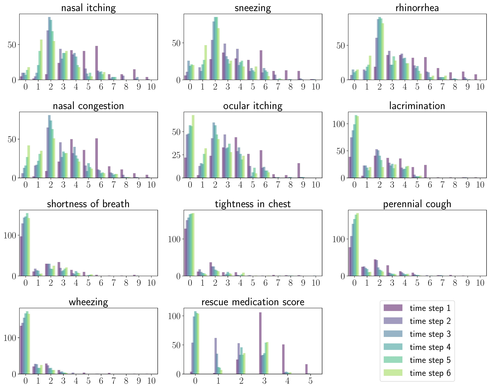

# Dataset for Patient Adherence in Subcutaneous Immunotherapy for Allergic Rhinitis

## Overview
This dataset encompasses data from 205 patients undergoing subcutaneous immunotherapy for allergic rhinitis. The dataset provides comprehensive insights into patient adherence, featuring demographic, clinical, and treatment-related variables. 

## Data Description

The dataset includes various demographic and clinical attributes of patients, reasons for therapy cessation, and score measurements over time. The statistics of the data are shown in the tables and figure.


| **Variables**                 |              | **Total** | **Adherent** | **Non-adherent** |
|-------------------------------|--------------|-----------|--------------|------------------|
| **Age**                       | ≤ 12         | 96 (46.7) | 40           | 56               |
|                               | 13--17       | 30 (14.6) | 10           | 20               |
|                               | ≥ 18         | 79 (38.7) | 23           | 56               |
| **Gender**                    | Female       | 62 (30)   | 22           | 40               |
|                               | Male         | 143 (70)  | 51           | 92               |
| **Distance to clinic (km)**   | ≤ 10         | 136 (66)  | 56           | 80               |
|                               | > 10         | 69 (34)   | 17           | 52               |
| **Cost/Family income (%)**    | < 30         | 107 (52.4)| 37           | 70               |
|                               | 30--50       | 77 (37.4) | 32           | 45               |
|                               | > 50         | 21 (10.2) | 4            | 17               |
| **EOS (× 10⁹/L)**             |              | 0.37; 0.41| 0.36; 0.52   | 0.38; 0.36       |
| **EOS %**                     |              | 0.05; 0.04| 0.05; 0.05   | 0.05; 0.05       |
| **ΔNR (%)**                   |              | 16.67; 59.70 | 30.00; 92.80 | 14.80; 50.00  |
| **ΔPNIF (%)**                 |              | 11.90; 34.50 | 12.70; 39.30 | 11.10; 28.80  |
| **Total IgE (kU/L)**          |              | 286; 543  | 340; 487     | 226; 555        |
| **sIgE of Derp (kU/L)**       |              | 30.80; 68.480 | 31.30; 74.40 | 30.40; 67.80  |
| **sIgE of Derf (kU/L)**       |              | 40.00; 68.20 | 40.60; 75.10 | 37.10; 65.70  |
| **Derp SPT SI**               |              | 1.04; 0.58 | 1.00; 0.59   | 0.82; 0.55      |
| **Derf SPT SI**               |              | 1.00; 0.50 | 0.82; 0.51   | 0.80; 0.45      |

*Table 1. Demographic and clinical data of the patients under subcutaneous immunotherapy. In the rows from Age to Cost/Family income, values indicate the number of patients (percentage, if available). Other rows represent the median and IQR. P-values are omitted due to their large values.*


| reasons for SCIT withdrawal | 5--12 mths | 13--18 mths | 19--24 mths | 25--36 mths | total by reason |
| --------------------------- | ---------- | ----------- | ----------- | ----------- | --------------- |
| no clinical improvement     | 18         | 11          | 8           | 21          | 58              |
| medical issue               | 3          | 1           | 2           | 0           | 6               |
| improved efficacy           | 0          | 0           | 0           | 24          | 24              |
| schooling                   | 3          | 3           | 0           | 5           | 11              |
| side effects                | 2          | 1           | 1           | 2           | 6               |
| Covid-19                    | 9          | 7          | 3           | 1           | 20             |
| personal issue              | 0         | 3         | 0          | 4          | 7              |
| total by time period        | 35         | 26          | 14          | 57        | 205             |

*Table 2. Detailed reasons for withdrawal from SCIT at different time points.*




*Figure 1. Histogram of scores across six-time steps. Score value (horizontal axis) vs. count (vertical axis).*


For the notations and comprehensive information about the data, please refer to [this link](<insert-link-here>).

## Utilization Guidelines

This dataset contains detailed information crucial for predicting patient adherence in subcutaneous immunotherapy for allergic rhinitis. It includes:

- **Columns 2-18:** Basic patient information, encompassing various demographic and clinical attributes.
- **Columns 1:** These columns capture the reasons for therapy cessation and the corresponding time. 
- **Columns 19 onwards:** These columns are dedicated to score measurements recorded at different time intervals - 0, 4, 12, 18, 24, and 36 months, providing a longitudinal view of patient outcomes. 

The dataset was randomly partitioned into training/validation and testing subsets. To replicate the exact dataset division as presented in our study, you may employ one of the following methods:

1. **Using sklearn.model_selection**:
   Utilize the `train_test_split` function, setting `test_size=0.2` and `random_state=42`.

2. **Using Predefined Indices**:
   Load the indices directly from the `data` folder.

## License

This project is licensed under the Creative Commons Attribution (CC BY) 4.0 International License - see the [LICENSE.md](LICENSE.md) file for details.

## Citing Our Work
If you use this dataset for your research, please cite our paper:

```bibtex
@article{Li2024Sequential,
  title={Sequential Model for Predicting Patient Adherence in Subcutaneous Immunotherapy for Allergic Rhinitis},
  author={Li, Yin and Xiong, Yu and Fan, Wenxin and Wang, Kai and Yu, Qingqing and Si, Liping and van der Smagt, Patrick and Tang, Jun and Chen, Nutan},
  year={2024},
}
```